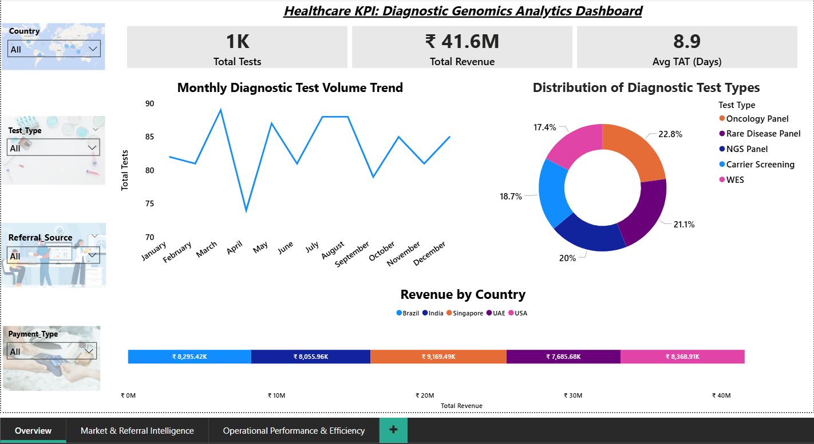
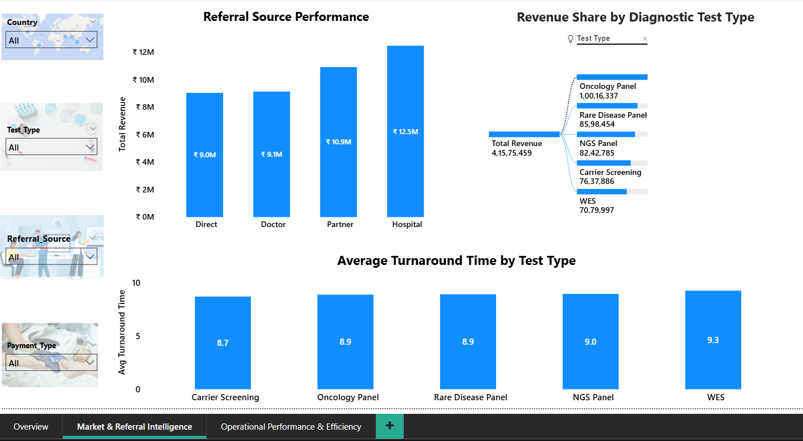
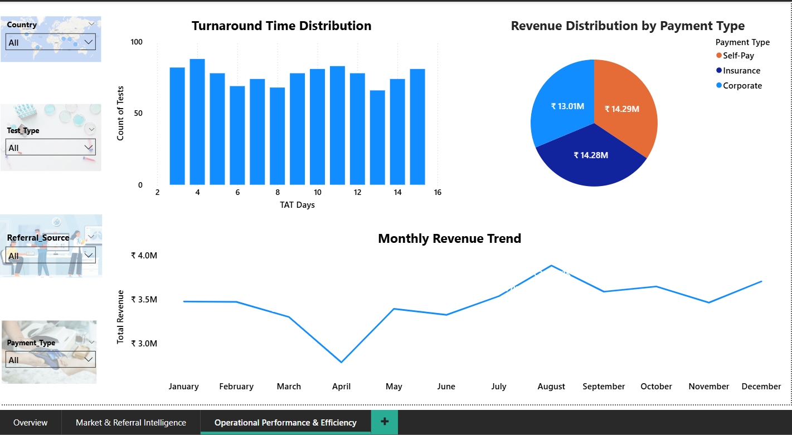

# Healthcare Diagnostic KPI Dashboard

This project analyzes diagnostic genomics testing performance across multiple markets.

## Project Overview
The dashboard provides insights into:
* Test volume trends
* Revenue distribution
* Market performance
* Operational efficiency
* Referral source contribution

## Tools Used
* **SQL** – Data analysis
* **Power BI** – Dashboard visualization
* **Excel** – Data generation

## Key Insights
* Oncology panels generate the highest revenue contribution.
* Hospital partnerships drive the largest referral volume.
* Majority of tests are delivered within a 7–10 days turnaround.

## Dashboard Preview

